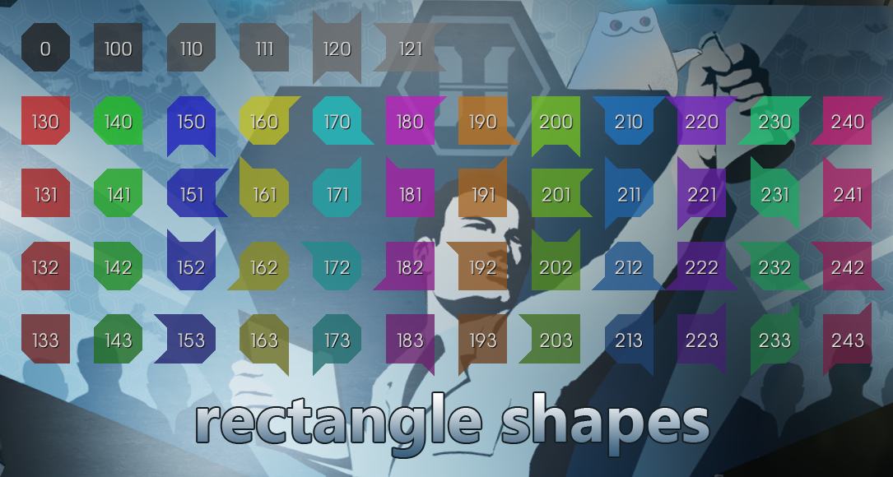

# KF2-BoxPainterLib

**2D box drawing library.  
Ported from [YetAnotherScoreboard](https://github.com/GenZmeY/KF2-YetAnotherScoreboard) and published under LGPLv3 due to licensing issues with some closed source mods.**  

## Add to your project
If your code uses the GPL or LGPL you can choose any of the methods below. But if you're using a different license and don't want to change it to the (L)GPL, then you should use methods 1 or 2, and don't make changes to the BoxPainterLib code.  

**Here are the ways:**  

### 1. As [git submodule](https://git-scm.com/book/en/v2/Git-Tools-Submodules)  
Open git-bash and go to your project: `cd <your_project_path>`  
Add submodule: `git submodule add https://github.com/GenZmeY/KF2-BoxPainterLib BoxPainterLib`  

**updating library:**  
Get updates: `pushd BoxPainterLib && git pull && popd`  
Commit the changes: `git add BoxPainterLib && git commit -m 'update box painter lib'`  

### 2. As standalone sources
Create a `BoxPainterLib` folder and put [this repo](https://github.com/GenZmeY/KF2-BoxPainterLib) there.  

### 3. As part of your sources (only for GPL and LGPL projects)
Include the BoxPainterLib code in your project wherever you want and however you like, make (or not) any changes  

## Using
1. Create `BoxPainter` object: `BoxPainter = new class'BoxPainterLib.BoxPainter';`  
2. Initialize the canvas: `BoxPainter.Canvas = <REPLACE_THIS_WITH_YOUR_CANVAS_OBJECT>;`  
3. `BoxPainter` is ready! Use functions [DrawBox(...)](https://github.com/GenZmeY/KF2-BoxPainterLib/blob/master/Classes/BoxPainter.uc#L3) and [DrawShapedBox(...)](https://github.com/GenZmeY/KF2-BoxPainterLib/blob/master/Classes/BoxPainterBase.uc#L129) to draw cool interface boxes.  

## Available Functions
**DrawShapedBox(float X, float Y, float W, float H, float Edge, byte TopLeftShape, byte TopRightShape, byte BottomLeftShape, byte BottomRightShape)**  
Draws a box using the [shape code](https://github.com/GenZmeY/KF2-BoxPainterLib/blob/master/Classes/BoxPainterBase.uc#L13) for each corner:  
- ECS_Corner
- ECS_BeveledCorner
- ECS_VerticalCorner
- ECS_HorisontalCorner

**DrawBox(float X, float Y, float Width, float Height, float Edge, optional byte Shape = 0)**  
Draws a box using the shape code:  

## Build
If you are using [KF2-BuildTools](https://github.com/GenZmeY/KF2-BuildTools) open `builder.cfg` and add `BoxPainterLib` **first** in `PackageBuildOrder` and `PackageUpload` parameters  
If you are building manually add line `ModPackages=BoxPainterLib` to your `KFEditor.ini` before all other `ModPackages`  
Now build the mod. `BoxPainterLib.u` library will be next to your `*.u` files  

## Examples
[KF2-YetAnotherScoreboard](https://github.com/GenZmeY/KF2-YetAnotherScoreboard)  

## License

